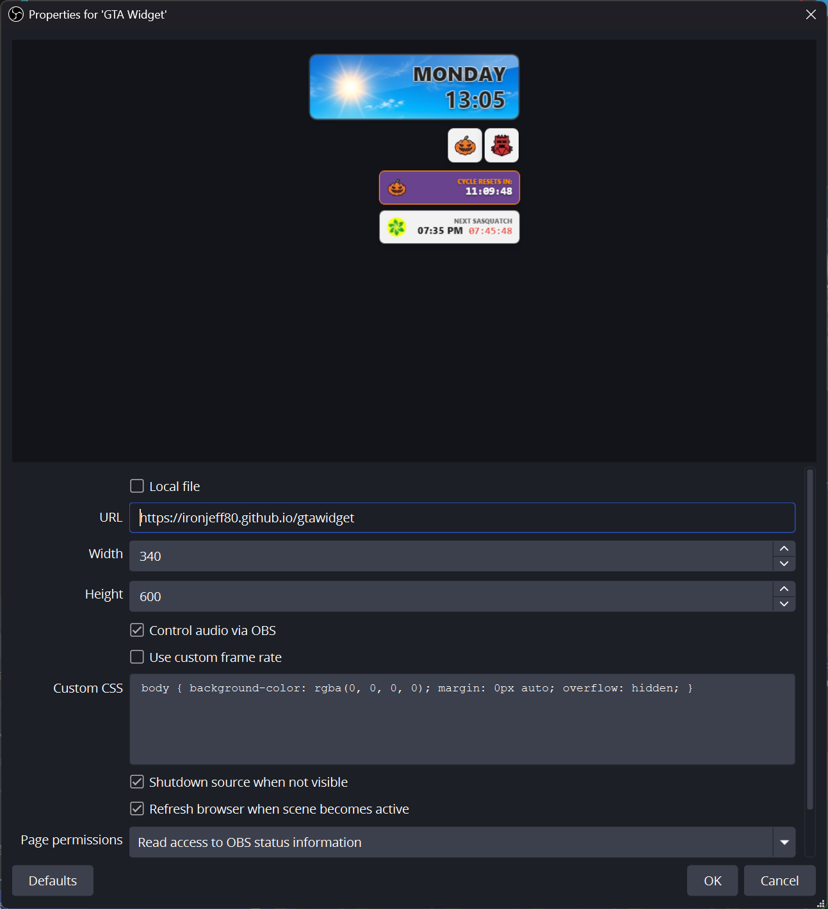

# 🚗 GTA Widget for OBS
> **The ultimate real-time game clock, weather tracker, and seasonal event manager for GTA streamers.**


This is a high-performance, real-time overlay designed for the GTA community. It features a perfectly calibrated game-time clock, a massive 384-hour weather loop synchronization, and automated seasonal event tracking (Sasquatch, UFOs, Ghosts Exposed, Slashers, etc.) with deep Streamer.bot integration.

---

## 📸 Preview


---

## ✨ Features
* ⏳ **Calibrated Game Clock:** Highly accurate time logic (2 seconds per game minute) synced to Unix time for perfect alignment with game day cycles.
* ☁️ **Weather Forecasting:** Predicts upcoming weather conditions based on a massive 384-hour loop schedule, with a toggleable "Next Weather" preview.
* 🎃 **Automated Seasonal Modules:** Intelligent UTC schedule logic for **420 Week** (Sasquatch & Stoner Survival), **Halloween** (Jack O' Lantern daily reset timer, UFOs, Ghosts Exposed, Christine, Cerberus, Possessed Animals, Slashers, and Sasquatch), and **Christmas** (Yeti & Gooch) that activate/deactivate automatically.
* 🔊 **Dynamic Audio Alerts:** Integrated spatial sound effects for rare spawns (e.g., Sasquatch growls and Survival alerts) that trigger the moment an event goes active.
* 🧪 **System Diagnostics:** Built-in debug panel (toggleable) to monitor Unix time, local sync, and loop positions in real-time.
* 🎨 **GTA Aesthetic:** Minimalist, professional UI with full-background weather art (or classic icon mode) and a dynamic Halloween "Spooky" theme during Phase 2 night hours.

---

## 🛠️ Setup Instructions

### 1. OBS Browser Source Setup
* **Add Source:** Create a new **Browser Source** in OBS.
* **URL:** Point it to `https://2smokinbarrels.com/gtawidget` or your fork's hosted GitHub Pages URL.
* **Dimensions:** Set Width to **340** and Height to **420**.
* **Audio:** Check **"Control Audio via OBS"** to manage the alert volume through your OBS mixer.
* **Sync:** Check **"Shutdown source when not visible"** and **"Refresh browser when scene becomes active"** to ensure the clock is always calibrated when you switch scenes.


---

### 2. URL Parameters (Customize Directly in OBS)
You can customize the widget directly in your OBS Browser Source URL without editing any code by adding parameters to the end of the URL:

| Parameter | Default | Example Value | Description |
| :--- | :--- | :--- | :--- |
| **`nextWeather`** | `false` | `nextWeather=true` | Shows the **Next Weather** countdown box below the active timers. |
| **`ShowPumpkins`** | `true` | `ShowPumpkins=false` | Shows the **Jack O' Lantern Daily Cycle** reset timer (06:00 UTC) during Halloween. Set to `false` to hide it once you've collected all 200 pumpkins. |
| **`icons`** | `false` | `icons=true` | Switches the main widget from Full-Background mode to classic **Icon Mode** (64×64 weather icon with sliding day/night background). |
| **`hwWeather`** | `false` | `hwWeather=true` | Manually forces **Halloween Weather (Phase 2)** mode on (enables the orange Halloween theme and extended `19:30–06:30` UFO hours). |
| **`showInfo`** | `false` | `showInfo=true` | Displays the **System Diagnostics** debug panel (Local time, Unix time, Game time, Weather loop index, and trigger logs). |

#### Example URLs:
* **Show Next Weather:**
  ```text
  [https://2smokinbarrels.com/gtawidget?nextWeather=true](https://2smokinbarrels.com/gtawidget?nextWeather=true)